# Binja architecture flows

This document reflects the current source layout. It intentionally omits historical performance ratios and blanket compatibility claims.

## Core source-string render

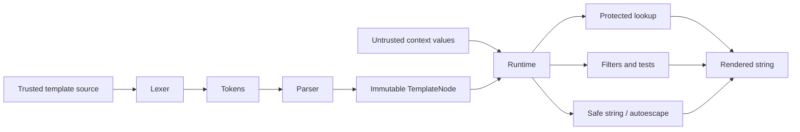

`render()` creates a short-lived `Environment`, compiles source to AST, and invokes the asynchronous runtime. `Environment.renderString()` reuses its configured runtime and loader.

## Loader-backed rendering

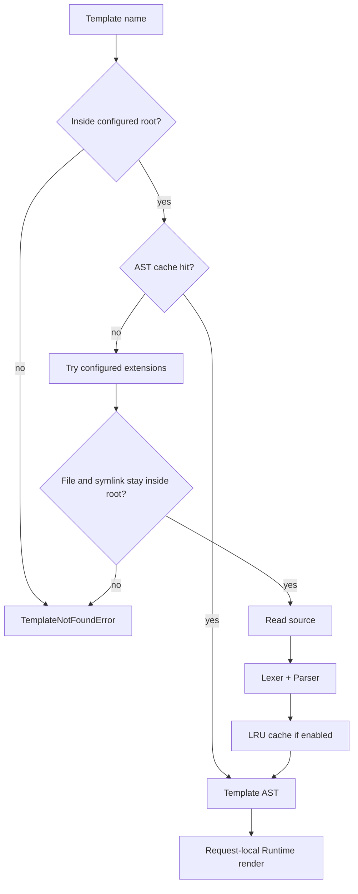

Cache hits move an entry to the newest LRU position. `cacheMaxSize` bounds AST count. Render-local state is not stored in the AST cache.

## Inheritance and includes

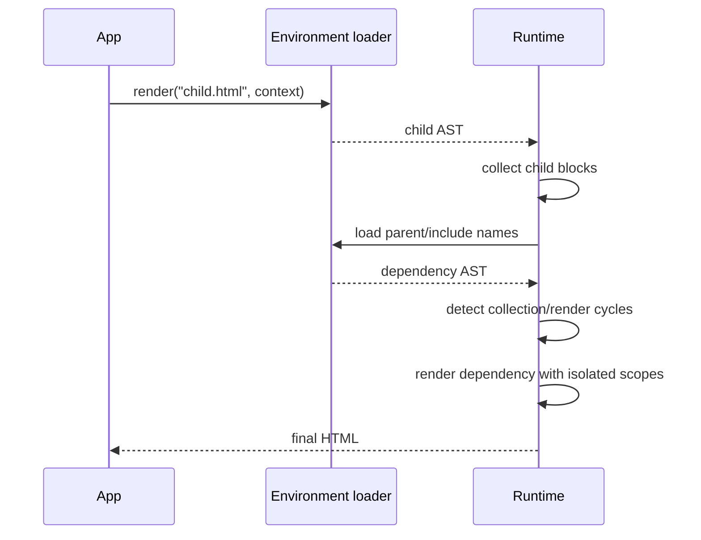

`ignore missing` catches only `TemplateNotFoundError`. Parser/filter/runtime errors from an existing include remain visible. Includes containing their own inheritance chain are rendered through an isolated block state.

## Render-local state

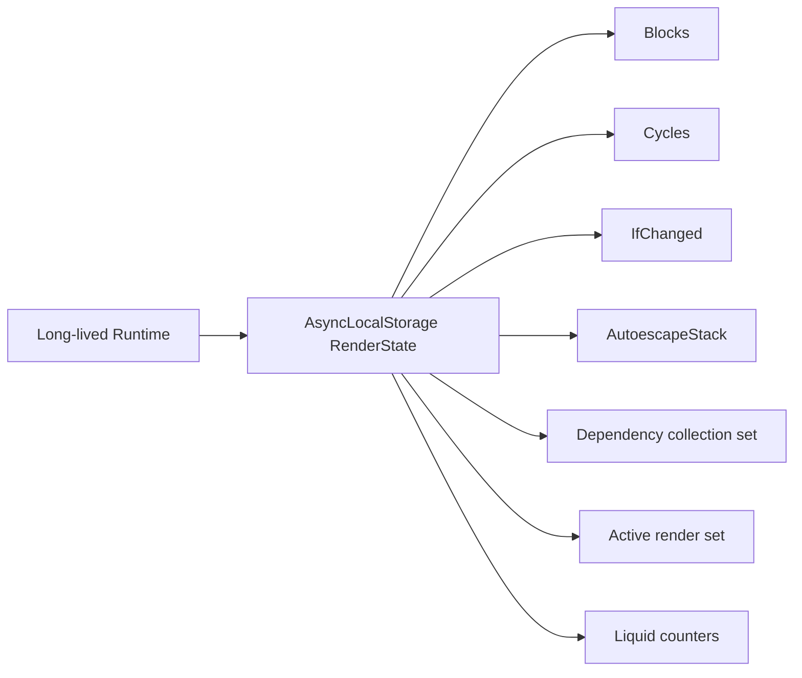

Every root render creates a new state. Context scopes, loop metadata, and changed-state tracking are restored with `try/finally`, including failure paths.

## Protected lookup and output

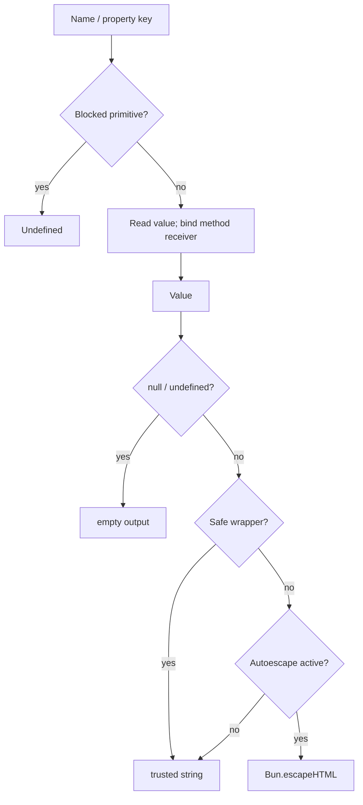

Blocked string keys are `__proto__`, `prototype`, `constructor`, `caller`, `callee`, and `arguments`. Mapping membership uses own keys only.

## AOT compilation

```mermaid
flowchart TD
  Source --> Parse[Lexer + Parser]
  Parse --> Supported{All nodes supported?}
  Supported -- no --> Reject[Explicit compile error]
  Supported -- yes --> Generate[Generate JS function source]
  Generate --> Bind[Bind runtime helper contract]
  Bind --> Sync[(context) => string]
```

Core `compile()` binds protected lookup, Jinja truthiness/stringification, iteration, and built-in filter/test dispatch. It returns a synchronous render function.

### Static dependency flattening

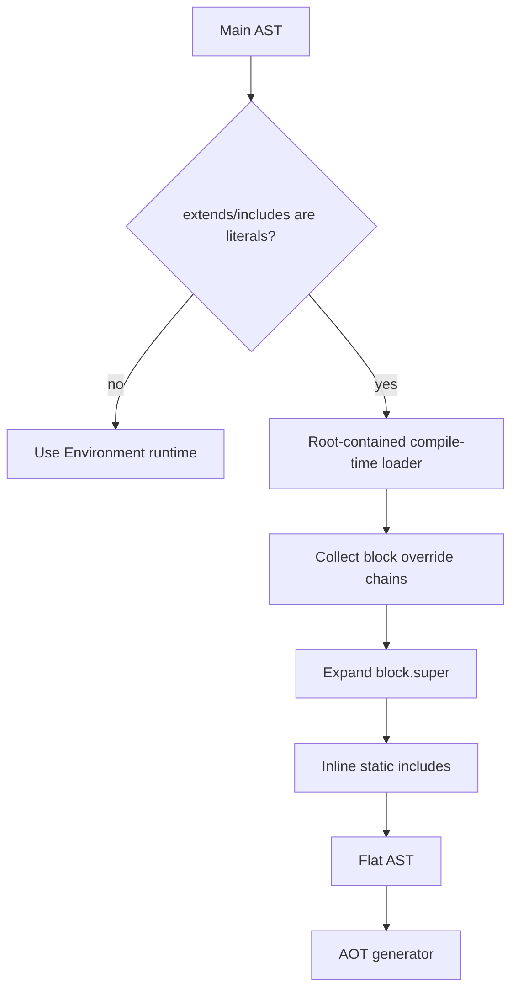

`compileWithInheritance()` binds helpers and returns an executable function. `compileWithInheritanceToCode()` returns only the generated function fragment. The CLI adds helpers, imports registries, and exports a complete ESM module.

## CLI flow

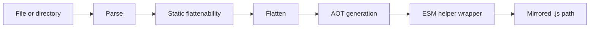

`check` stops after successful flattening and generation. Directory compile/check sets a non-zero exit status if any template fails. Dependency paths remain under the source root.

## Secondary engines

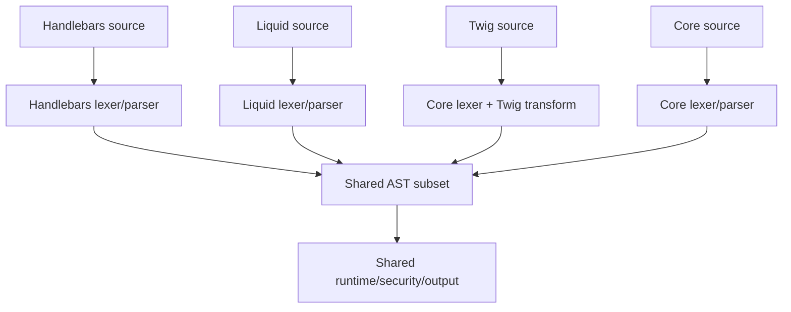

The shared AST does not imply complete upstream compatibility. The direct secondary APIs have no external template/partial loader and their `compile()` functions remain asynchronous parsed-runtime caches.

## Adapter flow

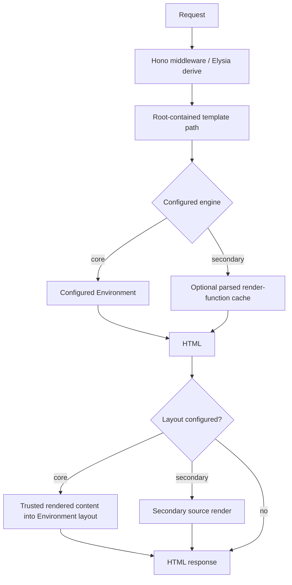

Core cached and uncached modes both use `Environment`, preserving include/inheritance semantics.

## Debug/query telemetry

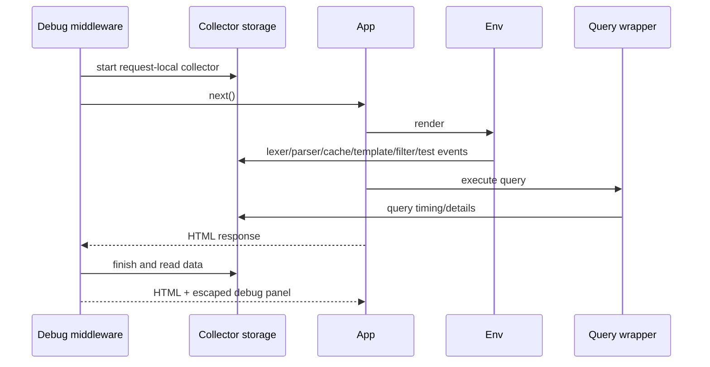

Debug values are escaped for HTML but can still disclose secrets. Collection is development-only.

## Benchmark harness

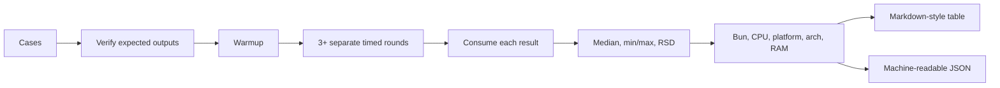

Sync and async cases use separate loops, and setup/compilation is excluded. See `benchmark/index.ts` and the documentation benchmark page for the current measured snapshot.
